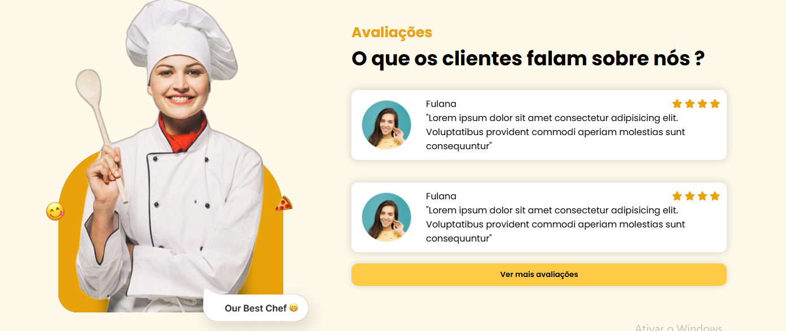

# Landing Page - Restaurante

Este projeto é uma landing page para um restaurante fictício, desenvolvida com foco em **responsividade** e **interatividade**.

## 🚀 Tecnologias

- HTML5
- CSS3 (Flexbox)
- JavaScript (JS Vanilla)
- jQuery

## 🎯 Objetivo

O objetivo foi criar uma landing page moderna e funcional para um restaurante, aplicando:

- Layout flexível com **display: flex**
- Responsividade para desktop, tablet e mobile
- Elementos interativos usando **JavaScript** e **jQuery** (como sliders, menus ou efeitos visuais)

## 🔗 Visualização

(Adicione o link caso hospede no GitHub Pages)

## 📷 Preview



## 💻 Como rodar

1. Clone este repositório:
   ```bash
   git clone https://github.com/SEU_USUARIO/restaurante-landing-page.git
